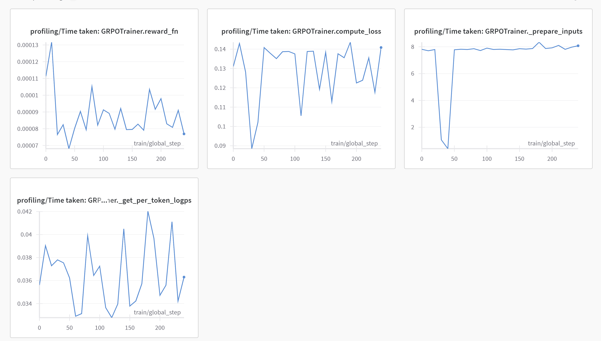

# My first RL model

Yipee! My first RL trained model. It bare bones and not very useful. We use Mistral 7B model and Reddit dataset (TLDR) to build a summarizer. The model get's a reward (or penalty) if the summary generated is different from 20 characters. The code was generated by ChatGPT. My goal was to run the entire setup on a 4xA100 machine. Given the simplistic nature of the reward model, its no surprise that the model hacks the reward.

# Developer

0. Setup Ubuntu dependencies:

```bash
sudo apt update
sudo apt install -y python3.10-dev libaio-dev
```

1. Install uv

```bash
curl -LsSf https://astral.sh/uv/install.sh | sh
```

2. Create the venv

```bash
uv venv --python 3.10
source .venv/bin/activate
uv sync
```

3. Hugging Face login. Enter token on prompt.

```bash
huggingface-cli login
```

4. Weights & Biases (wandb) login. And set env variables

```bash
wandb login
export WANDB_PROJECT=myfirstrlmodel
export WANDB_NAME=run-${RANK}  
```

5. Configure accelerate

 ```bash
accelerate config
```

6. Run the training job

```bash
accelerate launch train.py
```

7. Graphs from the training run:



Note: This is not a decent run. But hey it looks cool.

8. Inference:

